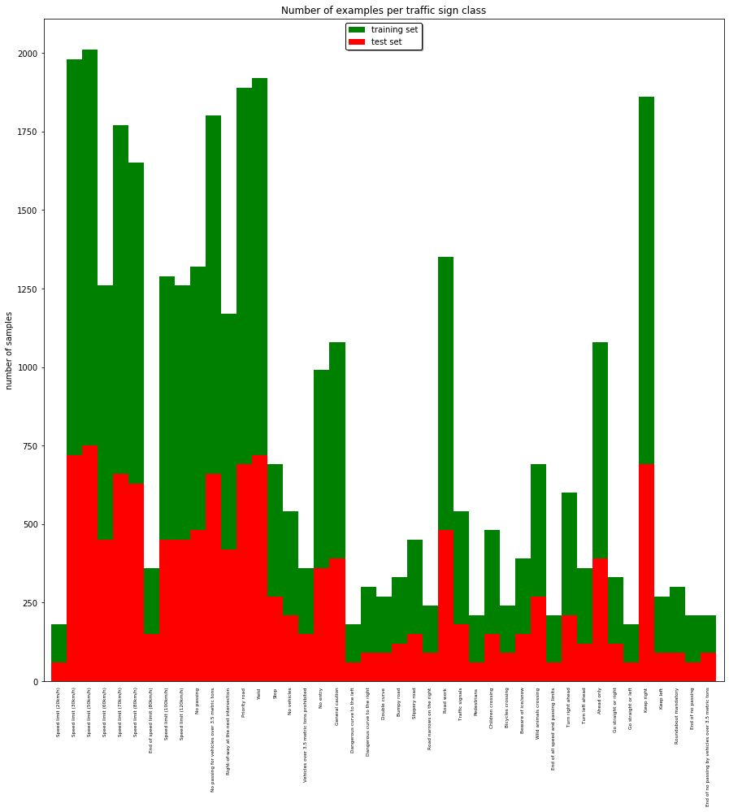

# **Traffic Sign Recognition**
[](http://www.udacity.com/drive)

## Dependencies ##
* ubuntu 19.04
* python 3.6.6
* tensorflow 2.0.0

## Preparations ##
* Download dataset by running the following commands
```bash
bash scripts/download_and_unzip_dataset.sh
```

**Build a Traffic Sign Recognition Project**

The goals / steps of this project are the following:
* Load the data set (see below for links to the project data set)
* Explore, summarize and visualize the data set
* Data Preprocessing:
    + Shuffling
    + Grayscaling
    + Normalization using mean and std Value of the train set
* Design, train and test a model architecture
* Use the model to make predictions on new images

[//]: # (Image References)

[image1]: ./examples/visualization.jpg "Visualization"
[image2]: ./examples/grayscale.jpg "Grayscaling"
[image3]: ./examples/random_noise.jpg "Random Noise"
[image4]: ./examples/placeholder.png "Traffic Sign 1"
[image5]: ./examples/placeholder.png "Traffic Sign 2"
[image6]: ./examples/placeholder.png "Traffic Sign 3"
[image7]: ./examples/placeholder.png "Traffic Sign 4"
[image8]: ./examples/placeholder.png "Traffic Sign 5"


### Data Set Summary & Exploration

#### 1. Provide a basic summary of the data set. In the code, the analysis should be done using python, numpy and/or pandas methods rather than hardcoding results manually.
* The size of training set is 34799
* The size of the validation set is 4410
* The size of test set is 12630
* The shape of a traffic sign image is 32x32x3
* The number of unique classes/labels in the data set is 43

#### 2. Include an exploratory visualization of the dataset.

Here is an exploratory visualization of the data set. It is a bar chart showing the distribution of the dataset



### Design and Test a Model Architecture


#### 2. Describe what your final model architecture looks like including model type, layers, layer sizes, connectivity, etc.) Consider including a diagram and/or table describing the final model.

My final model consisted of the following layers:

| Layer         		|     Description	        					|
|:---------------------:|:---------------------------------------------:|
| Input         		| 32x32x1 Grayscaled normalized image           |
| Convolution 3x3     	| 1x1 stride, same padding, outputs 32x32x32    |
| RELU					|												|
| Convolution 3x3     	| 1x1 stride, same padding, outputs 32x32x32    |
| RELU					|												|
| Max Pooling           | 2x2 stride,  outputs 16x16x32 				|
| Dropout				|												|
| Convolution 3x3     	| 1x1 stride, same padding, outputs 16x16x64    |
| RELU					|												|
| Convolution 3x3     	| 1x1 stride, same padding, outputs 16x16x64    |
| RELU					|												|
| Max Pooling           | 2x2 stride,  outputs 8x8x64  				|
| Dropout				|												|
| Convolution 3x3     	| 1x1 stride, same padding, outputs 8x8x128     |
| RELU					|												|
| Convolution 3x3     	| 1x1 stride, same padding, outputs 8x8x128     |
| RELU					|												|
| Max Pooling           | 2x2 stride,  outputs 4x4x128  				|
| Dropout				|												|
| Flatten				| outputs 2048                                  |
| Fully connected		| outputs 128                                   |
| RELU					|												|
| Dropout				|												|
| Fully connected		| outputs 43 (num classes)                      |
| Softmax				|                                               |
|						|												|


#### 3. Describe how you trained your model. The discussion can include the type of optimizer, the batch size, number of epochs and any hyperparameters such as learning rate.

To train the model, I used:
* optimizer: Adam
* batch size: 256
* epochs: 30
* learning rate: 0.001

#### 4. Model Evaluation

My final model results were:
* training set accuracy of 99.931%
* validation set accuracy of 98.141%
* test set accuracy of 97.2%

This architecture is based on the well-known [VGG-model](https://arxiv.org/pdf/1409.1556.pdf), which got the first runner-up on ImageNet Competition.

### Test a Model on New Images

This step can be seen on the step 3 of the notebook [Traffic_Sign_Classifier.ipynb](./notebooks/Traffic_Sign_Classifier.ipynb)
