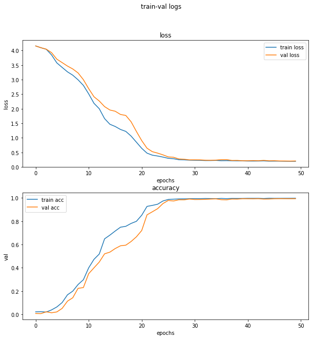

# **Traffic Sign Recognition**
[](http://www.udacity.com/drive)

## Dependencies ##
* ubuntu 19.04
* python 3.6.6
* tensorflow 2.0.0

## Preparations ##
* Download dataset by running the following commands
```bash
bash scripts/download_and_unzip_dataset.sh
```

**Build a Traffic Sign Recognition Project**

The goals / steps of this project are the following:
* Load the data set (see below for links to the project data set)
* Explore, summarize and visualize the data set
* Data Preprocessing: The following data augmentation processes are implemented in the [utility](./utility/data_augmentation.py)  module.
    + Shuffling
    + Grayscaling (Optional)
    + Rotation
    + Random crop and Resize to the original size
    + [Cutout](https://arxiv.org/abs/1708.04552): Masking out random sections of fixed size on input training images
    + Normalization using mean and std Value of the train set
* Design, train and test a model architecture
* Use the model to make predictions on new images

[//]: # (Image References)

[image1]: ./examples/visualization.jpg "Visualization"
[image2]: ./examples/grayscale.jpg "Grayscaling"
[image3]: ./examples/random_noise.jpg "Random Noise"
[image4]: ./examples/placeholder.png "Traffic Sign 1"
[image5]: ./examples/placeholder.png "Traffic Sign 2"
[image6]: ./examples/placeholder.png "Traffic Sign 3"
[image7]: ./examples/placeholder.png "Traffic Sign 4"
[image8]: ./examples/placeholder.png "Traffic Sign 5"


### I. Data Set Summary & Exploration

#### 1. Provide a basic summary of the data set. In the code, the analysis should be done using python, numpy and/or pandas methods rather than hardcoding results manually.
* The size of training set is 34799
* The size of the validation set is 4410
* The size of test set is 12630
* The shape of a traffic sign image is 32x32x3
* The number of unique classes/labels in the data set is 43

#### 2. Include an exploratory visualization of the dataset.

Here is an exploratory visualization of the data set. It is a bar chart showing the distribution of the dataset


#### 3. Data Augmentation.

As can be seen in the above figure, the distribution of the images per class is quite different. To keep the balance of the number of training images per class, I used the techniques stated above to get the same number of samples for each class. After augmentation, each class will have 2000 images for training. The new distribution can be seen in the following figure.


Here is the sample of an augmented image:


### II. Design and Test a Model Architecture

#### 1. Describe what your final model architecture looks like including model type, layers, layer sizes, connectivity, etc.) Consider including a diagram and/or table describing the final model.

My final model consisted of the following layers:

| Layer         		|     Description	        					|
|:---------------------:|:---------------------------------------------:|
| Input         		| 32x32x1 Grayscale or 32x32x3 RGB              |
| Convolution 3x3     	| 1x1 stride, same padding, outputs 32x32x32    |
| RELU					|												|
| Convolution 3x3     	| 1x1 stride, same padding, outputs 32x32x32    |
| RELU					|												|
| Max Pooling           | 2x2 stride,  outputs 16x16x32 				|
| Dropout				|												|
| Convolution 3x3     	| 1x1 stride, same padding, outputs 16x16x64    |
| RELU					|												|
| Convolution 3x3     	| 1x1 stride, same padding, outputs 16x16x64    |
| RELU					|												|
| Max Pooling           | 2x2 stride,  outputs 8x8x64  				|
| Dropout				|												|
| Convolution 3x3     	| 1x1 stride, same padding, outputs 8x8x128     |
| RELU					|												|
| Convolution 3x3     	| 1x1 stride, same padding, outputs 8x8x128     |
| RELU					|												|
| Max Pooling           | 2x2 stride,  outputs 4x4x128  				|
| Dropout				|												|
| Flatten				| outputs 2048                                  |
| Fully connected		| outputs 128                                   |
| RELU					|												|
| Dropout				|												|
| Fully connected		| outputs 43 (num classes)                      |
| Softmax				|                                               |
|						|												|

This architecture is based on the well-known [VGG-model](https://arxiv.org/pdf/1409.1556.pdf), which got the first runner-up on ImageNet Competition.
#### 3. Describe how you trained your model. The discussion can include the type of optimizer, the batch size, number of epochs and any hyperparameters such as learning rate.

- First of all, to consider the dimension of the input image (three dimension for RGB image or one dimension for grayscale image) to feed into the network, I had two training experiences using the network described in II.1: with original RGB training dataset and with the grayscaled training dataset (converted from the RGB fellows) (without augmentation to get more images). The training loss log and accuracy log can be seen in following graphs.


Fig. Train logs for RGB images train set


Fig. Train logs for grayscaled images train set

The accuracy for the case of grayscaled images is slightly better and the training log data is more stable than the case of RGB images. Therefore, I chose to train the network on grayscaled images with augmentation to get more images.

- To tackle with overfitting, I utilize dropout and L2 regularization to put constraint on the weights of all the convolution layers.

- I used Adam optimizer for training and the final hyperparameters that I used for training can be summarized as following:
  * batch size: 256
  * learning rate: 0.001
  * epochs: 50

From the previous two experiences without augmentation, I observed that the training converged quickly after around 20 epochs, so for the training with augmentation, I also chose a fairly low number of epochs of 50. And also it can be seen in the following graph that it converged after around 40 epochs.



#### 4. Model Evaluation

My final model results were:
* training set accuracy of 99.736%
* validation set accuracy of 99.342%
* test set accuracy of 98.1%

Here is the figures of confusion matrix of the test results when I did not use data augmentation and when I used data augmentation:


Fig. Confusion Matrix for the result of the case training without data augmentation


Fig. Confusion Matrix for the result of the case training with data augmentation

Comparing the two confusion matrix figures, it can be seen that data augmentation helps increasing the true positive rate of classes that has less number of samples before augmentation like end of no passing, pedestrian, double curve,...

### Test a Model on New Images

This step can be seen on the step 3 of the notebook [Traffic_Sign_Classifier.ipynb](./notebooks/Traffic_Sign_Classifier.ipynb)

The five images I found on the internet has large resolution compared to the images in the German Traffic Sign Dataset. These images are resized to the same size as the images in the original dataset of (32, 32), which means they are distorted and the image ratio is not kept. The trained model could recognize 4 out of 5 images correctly (for top 1 result), which gives accuracy of 80%, compared to the high value of accuracy of the test set above.
The top 5 result can be seen in the following figures.


For image number 2, 4, 5, the model was quite sure about the recognition result of almost 100%. For image number 3, it got it right but the model is not certain about the result as the score is less 70%. For the first image, it got it wrong though the correct label is in top 5 labels. This might be explained as forcefully resizing the image has distorted the shape of the traffic sign and made it difficult for the model to get the right answers. Also, most of the augmentation techniques I used on the training set reserved the ratio for the original shape of the traffic sign. To learn a more general representation that include distortion, more augmetation techniques that do not keep the original ratio like image shearing should be applied.
